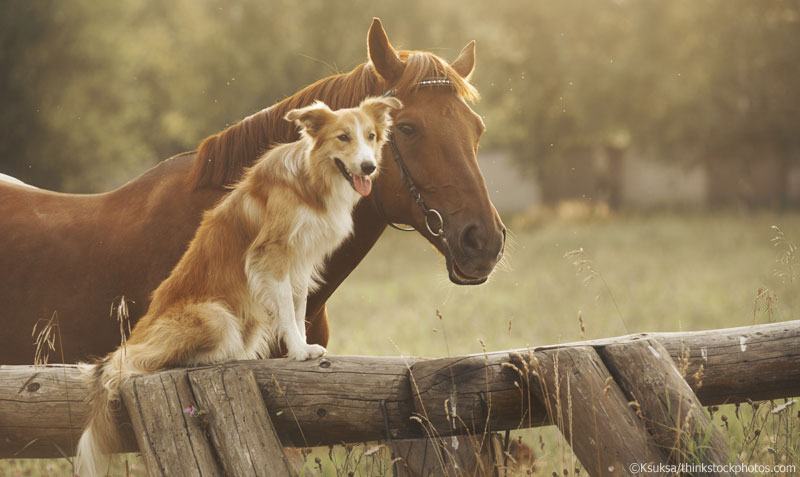
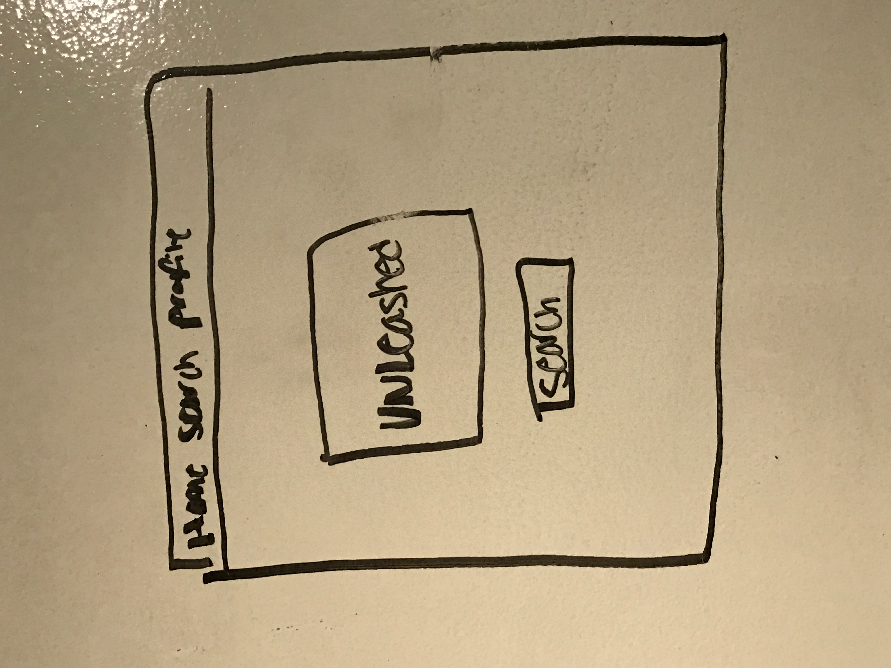
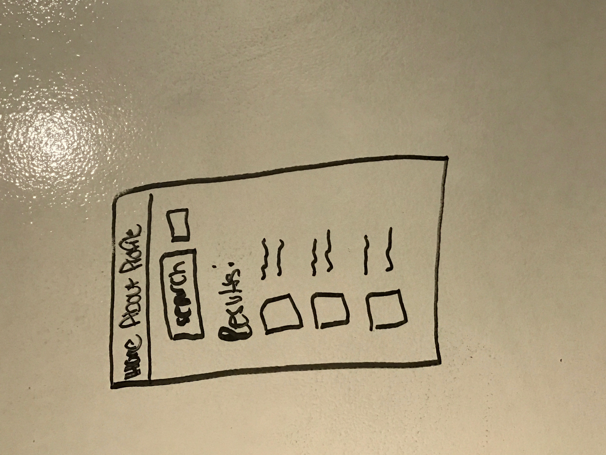

# unLeashed

## Introduction

**unLeashed** is intended to be a user friendly application for dog and horse owners to easily find campgrounds in the United States that allow animals. Users will be able to search for campgrounds using a variety of filters, and store those campgrounds to their profile for future reference. Users will also have the option to redirect to ReserveAmerica to view available dates and reserve campgrounds.

## Technology Used

* MongoDB
* Express
* Node.js
* Angular
* UI Router
* Facebook OAuth
* 3rd Party API
* Bootstrap

## Trello
[Click here for Trello](https://trello.com/b/0TamfD4F/unleashed)

## MVP
* Allow users to create an account
* Allow users to search for pet-friendly campgrounds
* Allow users to store campgrounds to a list on their profile
* Allow users to edit their profile information
* Allow users to share campgrounds to social media
 
 ##Wireframes
 

## ERD
